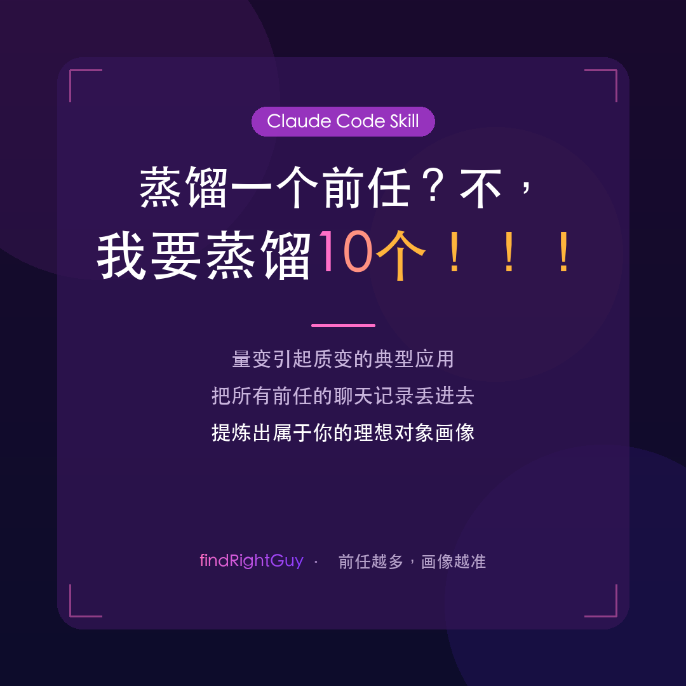

# exs-skill

<div align="center">
  
</div>

> 蒸馏一个前任？不，我要蒸馏10个！

你曾经爱过的每一个人，都在不经意间告诉了你——**你真正想要的是什么**。

问题是，那些答案散落在几万条聊天记录里，夹在"在吗"和"哦"之间，没人替你整理过。

直到现在。

**exs-skill** 是一个运行在 Claude Code 上的 Skill，把你所有前任的聊天记录丢进去，它会替你找出：哪些对话让你越聊越开心、对方做了什么让你忍不住哈哈哈、什么样的人让你愿意主动发消息。然后把这些特征跨前任聚合，提炼出属于你的「理想对象画像」。

> 量变引起质变的典型应用——前任越多，画像越准。

---

**目录**

- [它能做什么](#它能做什么)
- [工作原理](#工作原理)
- [安装](#安装)
- [快速开始](#快速开始)
- [数据安全](#数据安全)
- [License](#license)

---

## 它能做什么

| 命令 | 功能 |
|------|------|
| `/analyze-ex` | 导入新前任聊天记录，更新理想画像 |
| `/ideal-chat` | 与理想对象 AI 对话（持续学习进化） |
| `/export-template` | 导出最新恋爱模版 |
| `/advisor` | 恋爱顾问模式（分析新对象 / 主动咨询） |
| `/show-profile` | 查看当前理想对象画像摘要 |
| `/list-exes` | 查看所有已录入前任及贡献图谱 |
| `/rollback {version}` | 回滚到历史版本的理想画像 |

---

## 工作原理

一句话版本：**它不分析前任，它分析你**。

具体来说：
1. 把聊天记录扔进来，系统扫描你每一条回复里的情绪信号——emoji 数量、语气词、回复速度、回复长度
2. 找出那些「越聊越开心」的对话片段，打上标记
3. 从这些优质片段里提取：对方说了什么、做了什么，触发了你的好情绪
4. 把所有前任的特征按「化学反应评分 × 优质对话占比」加权融合，得出你的理想画像

> 一个梦做了一万次，也许能够成真——当你把足够多的数据喂进去，那个「完美的他」的轮廓会越来越清晰。

---

## 安装

```bash
# 通过 skills.sh 安装
npx skills add shyguochao/exs-skill

# 安装 Python 依赖
pip install -r requirements.txt
```

---

## 快速开始

1. 导出微信或 QQ 聊天记录（支持 txt / json / csv / html 等格式）
2. 运行 `/analyze-ex`，按提示上传聊天记录
3. 分析完成后，运行 `/ideal-chat` 开始对话
4. 随时运行 `/export-template` 导出最新恋爱模版，打印出来贴在床头也行

前任越多，画像越准。这大概是人类史上唯一一个「前任数量是优势」的场景。

---

## 数据安全

所有数据仅存储在本地 `data/` 目录，不上传任何服务器。

你的故事，只属于你自己。

---

## License

MIT © 2026 [shyguochao](https://github.com/shyguochao)

本项目以 MIT 协议开源。你可以自由使用、修改、分发——但请记住：
用它好好对待下一个人。
